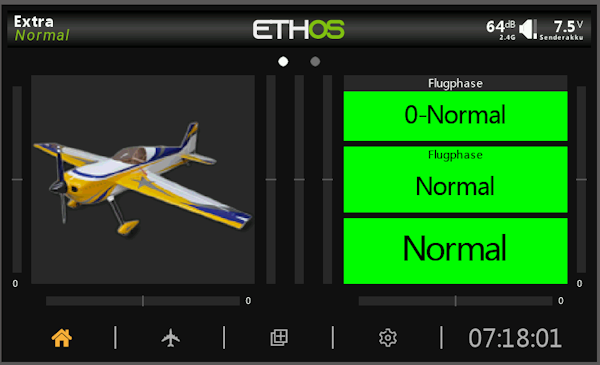
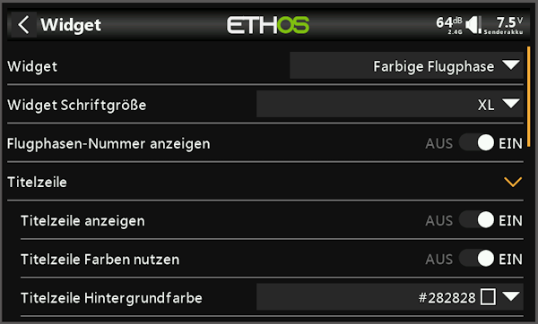
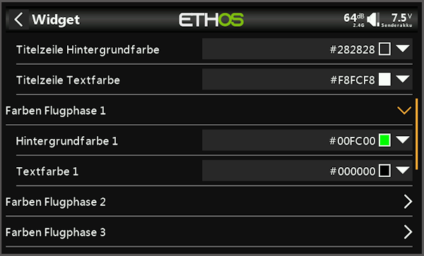
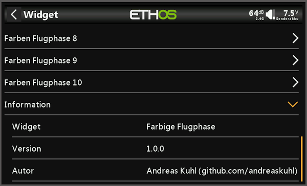

## 🌐 Andere Sprachen | Other Languages
- [Englisch | English](readme.md)
  
ℹ️ Die englische Version ist KI-übersetzt von der deutschen Version readme.de

***

<h1 name="top"> CFLMODE | Farbige Flugphase </h1>
FrSky-Ethos-Widget zur farbigen Anzeige der aktuellen Flugphase.

Version 1.0.0 - https://github.com/andreaskuhl/cflmode

|                      |                                                     |
| -------------------- | --------------------------------------------------- |
| Entwicklungsumgebung | Ethos X20S-Simulator 1.6.3                          |
| Testumgebung         | FrSky Tandem X20, Ethos 1.6.3 EU, Bootloader 1.4.15 |
| Autor                | Andreas Kuhl (https://github.com/andreaskuhl)       |
| Lizenz               | GPL 3.0                                             |

Wenn es Ihnen gefällt, können Sie es mit einer Spende unterstützen!

  

***

- [Funktionalität](#funktionalität)
- [Ideen zu weiteren Funktionen \& Verbesserung](#ideen-zu-weiteren-funktionen--verbesserung)
- [Installation](#installation)
- [Danksagung](#danksagung)
- [Bilder](#bilder)
- [Release Informationen](#release-informationen)

# Funktionalität

  - **Farbige Anzeige der aktuelle Flugphase**  
  Anzeige der aktuellen Flugphase, wenn gewünscht mit vorangestellter Flugphasennummer. Dabei kann für jede Flugphase sowohl die Hintergrundfarbe als auch die Textfarbe gewählt werden. Es werden bis zu 10 Flugphasen unterstützt.
  - **Anzeige Individualisierung**  
  Titelzeile ("Flugphase") ein/ausschalten, optional wählbare Text- und Hintergrund-Farbe für die Titelzeile.
 - **Lokalisierung**:  
 Deutsch (de), Englisch (en), Französisch (fr), Spanisch (es), Italienisch (it) und Tschechisch (cs)
  

# Ideen zu weiteren Funktionen & Verbesserung
  - Weitere Lokalisierung -> Bei Bedarf einfach melden ... oder noch besser eine Übersetzung zuliefern.
  
  Bitte melden wenn dafür, bzw. für andere Funktionen, ein Bedarf besteht.  
  => Einfach in GitHub ein Issue einstellen, natürlich ebenso bei Fehlern!
  
  
# Installation
- Ggf. bestehende alte / Vorgänger Version löschen (gesamtes Verzeichnis des alten Widgets). 
- Aus dem aktuellen GitHub-Release die cflmode_x_x_x.zip herunterladen und daraus das Verzeichnis "cflmode" in das "scripts"-Verzeichnis der X20-SD-Karte kopieren.

# Danksagung
Vielen Dank an die folgenden Mitstreiter:
- Initiale Idee/Anforderung von Andreas Rieken

# Bilder
   
# Release Informationen

| Version |   Datum    | Veränderung                                                                                     | Autor        |
| ------: | :--------: | ----------------------------------------------------------------------------------------------- | ------------ |
|   1.0.0 | 05.10.2025 | Initiale Entwicklung (Farbige Anzeige der Flugphase, Titel ein/ausschaltbar) und Dokumentation. | Andreas Kuhl |

[↑ Zurück nach oben](#top)
