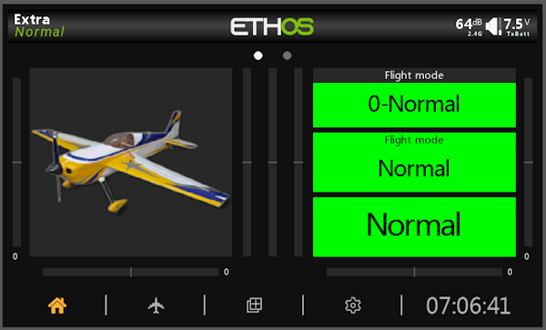
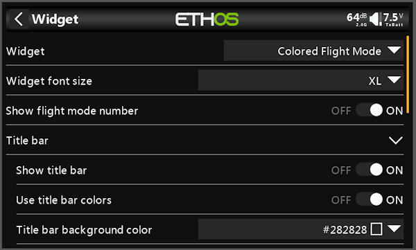
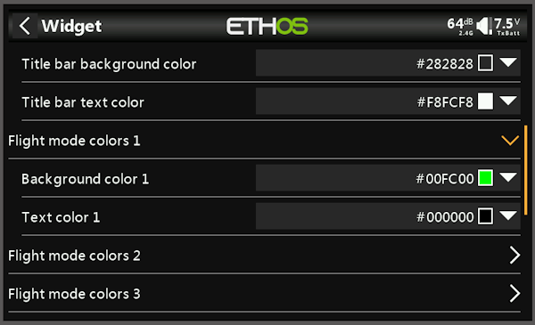
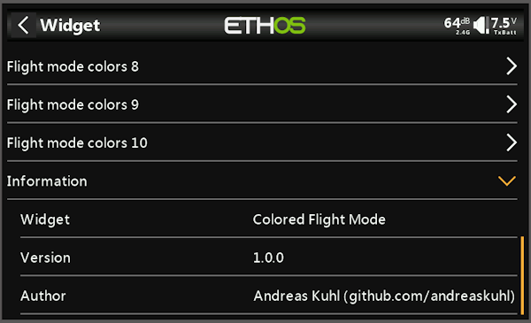

## 🌐 Other Languages | Andere Sprachen
- [German | Deutsch](readme.de.md)
  
ℹ️ The German version is the original, this English version is AI-translated from readme.de

***

<h1 name="top"> CFLMODE | Colored Flight Mode </h1>
FrSky Ethos widget for color display of the current flight mode.

Version 1.0.0 - https://github.com/andreaskuhl/cflmode

|                      |                                                     |
| -------------------- | --------------------------------------------------- |
| Development Env.     | Ethos X20S Simulator 1.6.3                          |
| Test Environment     | FrSky Tandem X20, Ethos 1.6.3 EU, Bootloader 1.4.15 |
| Author               | Andreas Kuhl (https://github.com/andreaskuhl)       |
| License              | GPL 3.0                                             |

If you like it, you can support it with a donation!

  

***

- [Functionality](#functionality)
- [Ideas for Further Features \& Improvements](#ideas-for-further-features--improvements)
- [Installation](#installation)
- [Acknowledgements](#acknowledgements)
- [Images](#images)
- [Release Information](#release-information)

# Functionality

  - **Colored display of the current flight mode**  
  Display of the current flight phase in the desired font size. Optionally, the flight phase number can be shown in front. For each flight phase, both the background color and the text color can be individually selected. Up to 10 flight phases are supported.  
  - **Display customization**  
  Title bar ("Flight Mode") can be toggled on/off, with optional selectable text and background color for the title bar.
 - **Localization**:  
  German (de), English (en), French (fr), Spanish (es), Italian (it), and Czech (cs)
  

# Ideas for Further Features & Improvements
  - More localizations -> Just get in touch if needed ... or even better, contribute a translation.
  
  Please get in touch if you need this or other features.  
  => Simply open an issue on GitHub, of course also for bugs!
  
  
# Installation
- If necessary, delete any existing old/previous version (entire directory of the old widget).
- Download cflmode_x_x_x.zip from the current GitHub release and copy the "cflmode" directory from it into the "scripts" directory of the X20 SD card.

# Acknowledgements
Many thanks to the following contributors:
- Initial idea/requirement by Andreas Rieken

# Images
   
# Release Information

| Version |   Date     | Change                                                                                         | Author        |
| ------: | :--------: | ---------------------------------------------------------------------------------------------- | ------------ |
|   1.0.0 | 05.10.2025 | Initial development (colored flight mode display, toggleable title) and documentation.         | Andreas Kuhl |

[↑ Back to top](#top)
